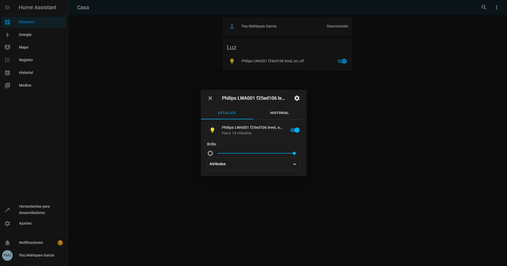
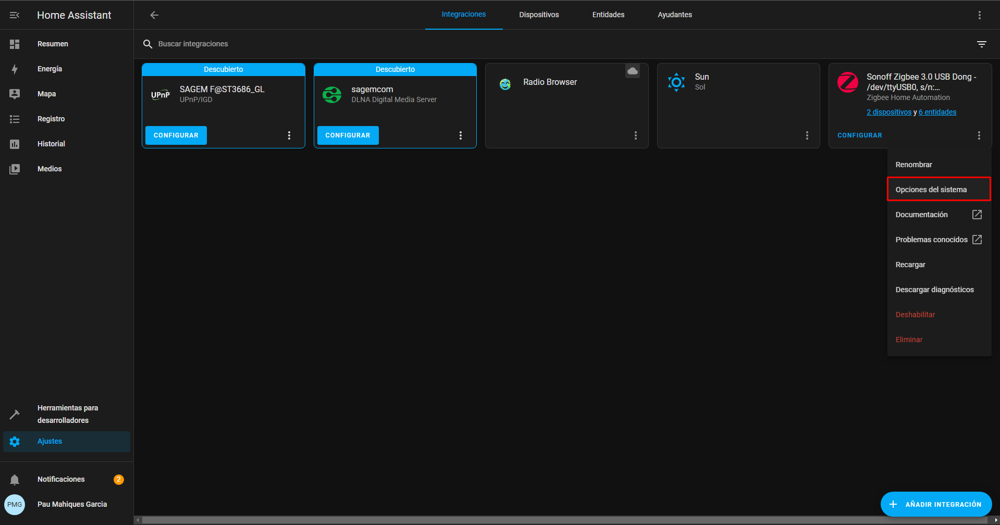

# Añadir dispositivo Zigbee en Home Assistant

## Emparejar

1. Para que los dispositivos se puedan unir a nuestra red Zigbee debemos activar "Habilitar entidades recien añadidas" en la configuracion de Zigbee en Home assistant (mas adelante en la guia se mostrara como hacerlo), una vez que hayamos unido todos los dispositivos que queramos es importante desactivar "Habilitar entidades recien añadidas" para evitar que se unan accidentalmente otros dispositivos
2. Pondremos el dispositivo de nuestra eleccion (en esta guia usaremos una bombilla Philips Hue) en modo deteccion, si no hay instrucciones disponibles de como hacerlo es probable que entre en modo deteccion despues de un reseteo de fabrica
3. Zigbee deberia detectar y enlazar automaticamente el dispositivo, para comprobar si se ha enlzado corractamente podemos ingresar a la interfaz web de Home Assistant en el puerto 8123(si habeis seguido nuestra guia) y deberia aparecer ahi el dispositivo

4. Si presionamos el nombre del dispositivo veremos unos detalles y podremos activarlo/desactivarlo o ir a su configuración

5. Si vamos a la configuración del dispositivo podremos cambiarle nombre default a uno mas amigable

6. Para mas opciones iremmos a Ajustes > Dispositivos y servicios

7. Si presionamos en los tres puntos de la integración Zigbee y le damos a "Opciones del sistema" podremos activar/desactivar "Habilitar entidades recien añadidas" para permitir/evitar que se unan dispositivos libremente

8. Si presionamos en dispositivos nos aprecera una lista con todos los dispositivos en nuestra red Zigbee, y si clicamos en ellos accederemos a sus detalles y podremos hacer escenas, automatizaciones, scripts, etc...

Y ya habriamos visto como vincular un dispositivo Zigbee en Home Assistant y visto algunas de las cosas que podemos hacer con ellos, solo queda disfrutarlo!
