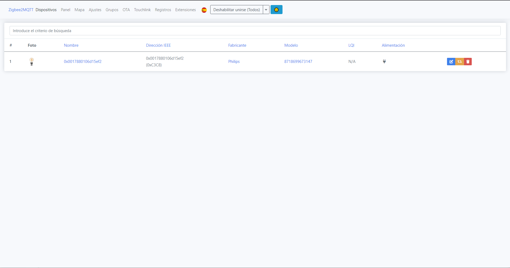
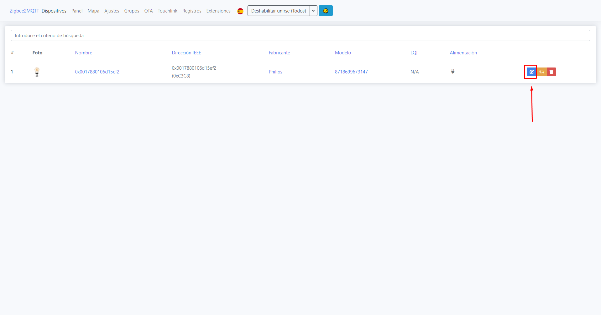
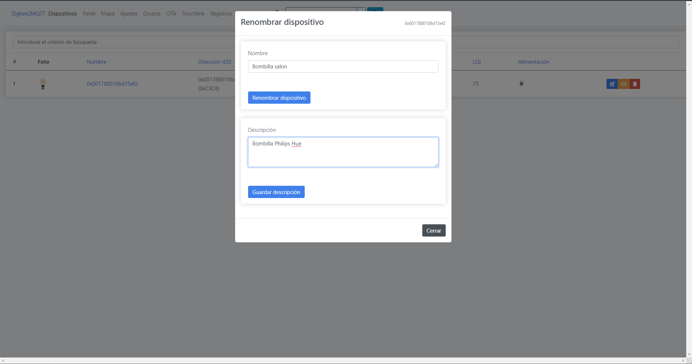
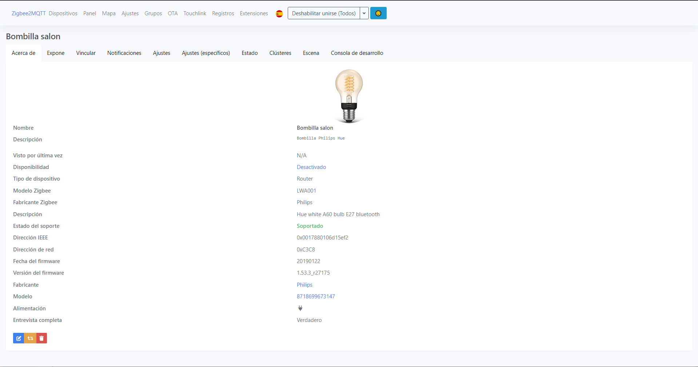
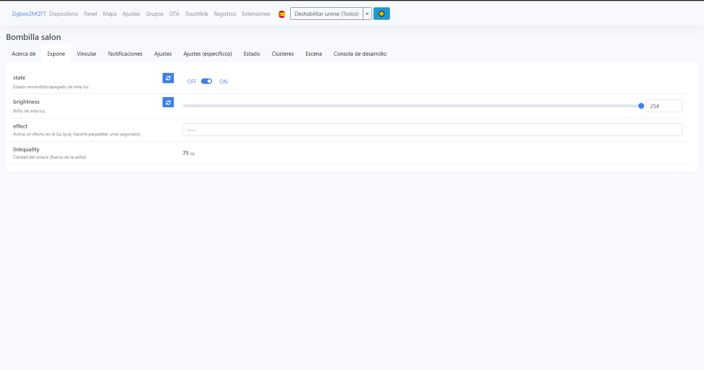
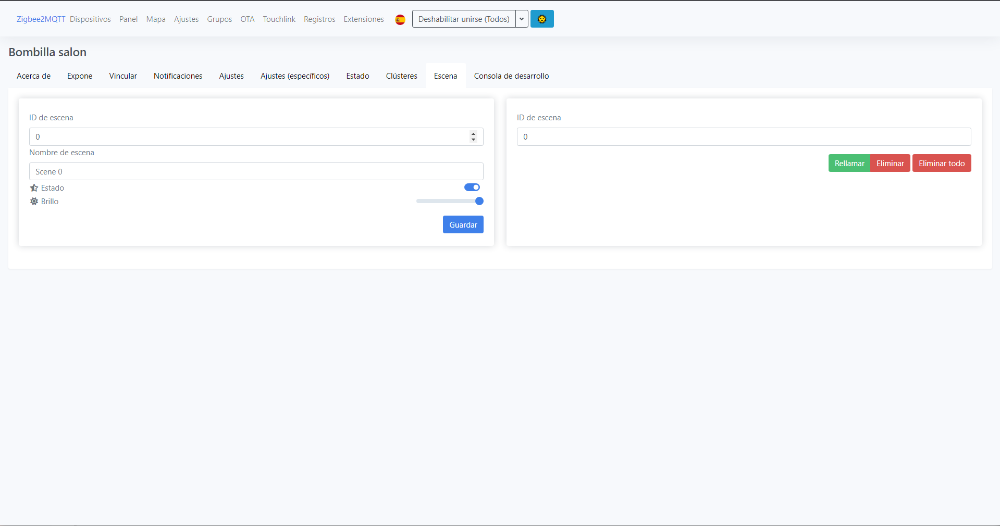

# Añadir dispositivo Zigbee con Zigbee

## Emparejar

1. Para que los dispositivos se puedan unir a nuestra red Zigbee en el archivo de configuración de Zigbee la opción "permit join" debe ser "true", una vez que hayamos unido todos los dispositivos que queramos es importante cambiar la opción a "false" para evitar que se unan accidentalmente otros dispositivos
2. Pondremos el dispositivo de nuestra eleccion (en esta guia usaremos una bombilla Philips Hue) en modo deteccion, si no hay instrucciones disponibles de como hacerlo es probable que entre en modo deteccion despues de un reseteo de fabrica
3. Zigbee deberia detectar y enlazar automaticamente el dispositivo, para comprobar si se ha enlzado corractamente podemos ingresar a la interfaz web de Zigbee en el puerto 8080(si habeis seguido nuestra guia) y deberia aparecer ahi el dispositivo

4. Si presionamos en la siguiente opción podremos renombrar el dispositivo y añadirle una descripción para quitarle el nombre default

5. Si presionamos en su nombre nos apareceran unos datos del dispositivo y diferentes secciones con todo lo que podemos hacer con el, por ejemplo encenderlo y apagarlo, crear escenas, cambiar el brillo, etc...

Y ya habriamos visto como vincular un dispositivo Zigbee con Zigbee y visto algunas de las cosas que podemos hacer con ellos, solo queda disfrutarlo!
