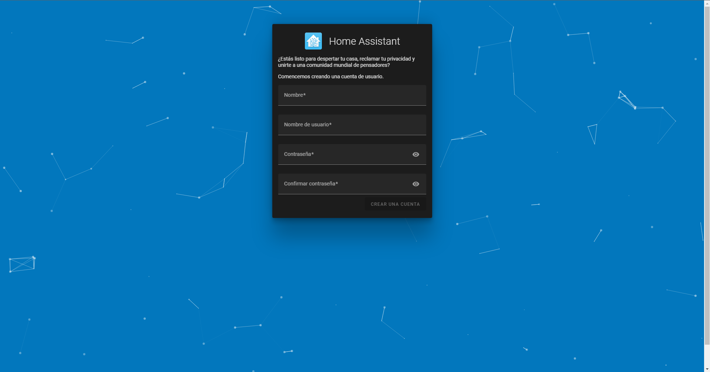

# Instalar Home Assistant con Docker

## Instalación

1. Creamos un directorio donde ira el archivo de configuración de docker
~~~
mkdir docker
cd docker
~~~
2. Creamos el archivo "docker-compose.yml"
~~~
touch docker-compose.yml
~~~
3. Le añadimos las siguientes lineas al archivo de Docker
~~~
version: '3'
services:
  homeassistant:
    container_name: homeassistant
    image: "ghcr.io/home-assistant/home-assistant:stable"
    volumes:
      - /PATH_TO_YOUR_CONFIG:/config
      - /etc/localtime:/etc/localtime:ro
    restart: unless-stopped
    privileged: true
    network_mode: host
~~~
4. Iniciamos Home Assistant con el siguiente comando
~~~

~~~
5. Ahora podremos acceder a la instalación de Home Assistant a traves de la interfaz web introduciendo vuestra ip seguido del puerto 8123, ex: 192.168.0.10:8123, deberiamos ver esta pagina:

## Configuración

Una vez instalado Home Assistant podemos seguir la siguiente guia para configurarlo:
* [Configurar Home Assistant](homeassistant_web.md)
