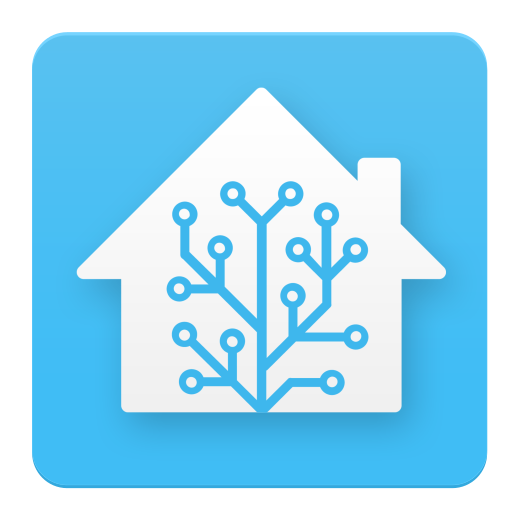
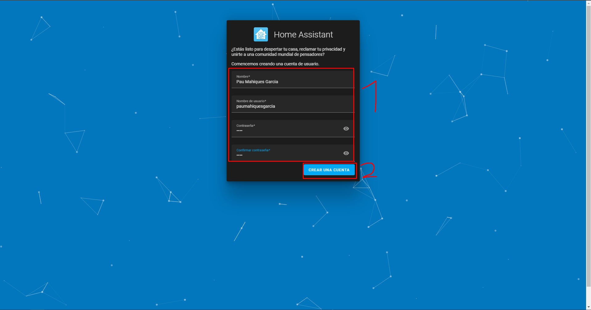
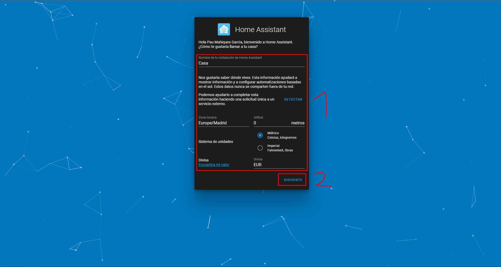
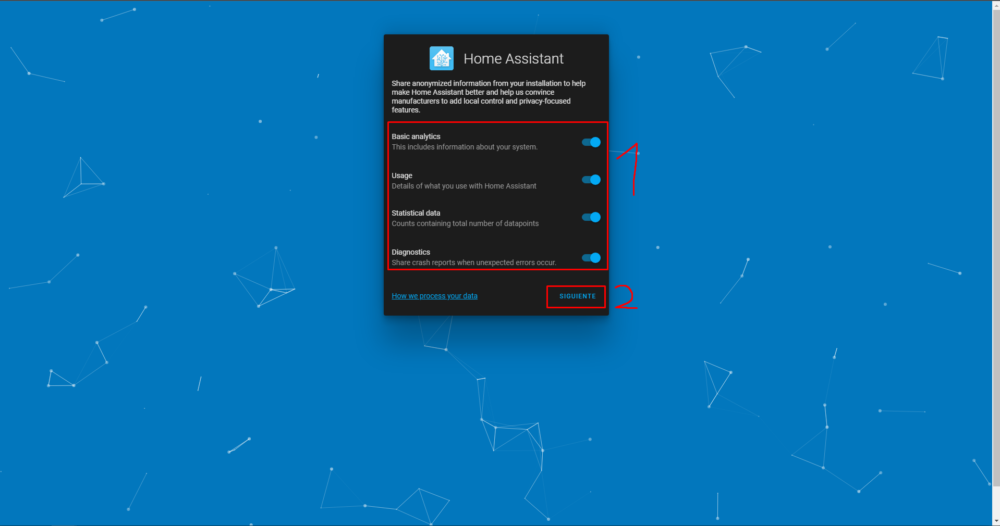
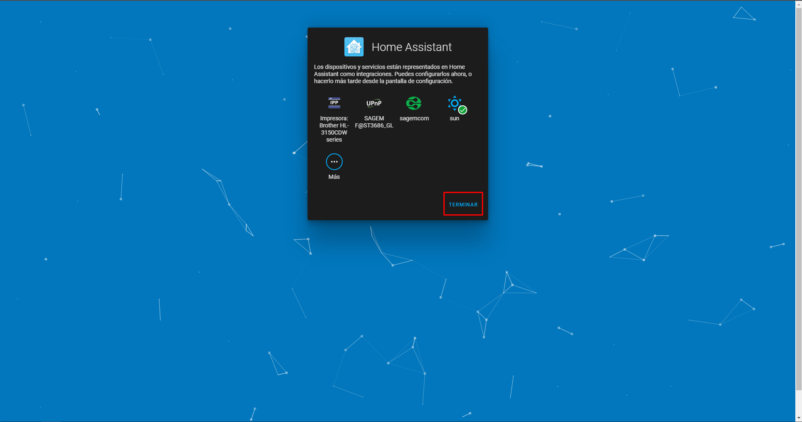

# Configurar Home Assistant

  

## Configuracion

1. Introduciremos nuestro nombre, un nombre de usuario, una contraseña y le daremos a "crear una cuenta":

2. Ahora introduciremos el nombre de la instalación, nuestra zona horaria, altitud, sistema de unidades, divisa y le daremos a "siguiente":

3. Esta parte es opcional, cada punto es información que podemos compartir para ayudar al desarrollo de Home Assistant, seleccionamos los que queramos y le damos a "siguiente":

4. Le damos a "TERMINAR"

Y ya lo tendriamos configurado
