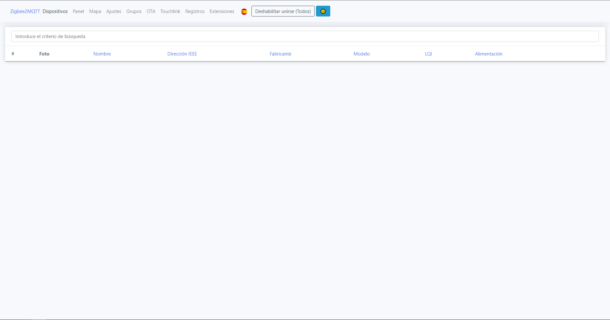

# Instalación de Zigbee a traves de consola

## Requisitos

Para poder seguir esta guia necesitamos tener un USB CC2531 flasheado con el firmware de Zigbee

* [Flashear USB CC2531](flash_stick.md)

## Instalación

1. Primero debemos encontrar la localización del apadtador Zigbee, conectalo a la raspberry y ejecuta este comando (en esta guia vamos a asumir que el adaptador esta montado en ttyACM0, pero puede que no sea vuestro caso):
~~~
sudo dmesg
~~~
2. Ahora instalaremos Node.js y algunas dependencias:
~~~
sudo apt-get install -y nodejs npm git make g++ gcc
~~~
3. Clonaremos el repositorio de Zigbee2MQTT y lo moveremos:
~~~
git clone https://github.com/Koenkk/zigbee2mqtt.git
sudo mv zigbee2mqtt /opt/zigbee2mqtt
~~~
4. Instalaremos algunas dependencias:
~~~
cd /opt/zigbee2mqtt
npm ci
~~~
5. Instalaremos y activaremos un servidor MQTT (nosotros instalamos mosquito pero podeis instalar vuestro favorito
~~~
sudo apt-get install mosquitto
sudo systemctl start mosquitto.service
sudo systemctl enable mosquitto.service
~~~

## Configuración

1. Abrimos el fichero de configuración
~~~
nano /opt/zigbee2mqtt/data/configuration.yaml
~~~
2. Para una configuración basica, solo tendremos que cambiar el puerto donde tengamos el adaptador
~~~
mqtt:
  # MQTT base topic for Zigbee2MQTT MQTT messages
  base_topic: zigbee2mqtt
  # MQTT server URL
  server: 'mqtt://localhost'
  # MQTT server authentication, uncomment if required:
  # user: my_user
  # password: my_password

serial:
  # Location of the adapter (see first step of this guide)
  port: /dev/ttyACM0
~~~

## Iniciando Zigbee2MQTT

Ahora que ya lo tenemos instalado y configurado solo queda iniciarlo:
~~~
cd /opt/zigbee2mqtt
npm start
~~~

## Pagina web Zigbee2MQTT

1. Zigbee tiene una pagina web que para iniciarla teneis que añadir la siguiente linea al archivo de configuración de Zigbee2MQTT
~~~
frontend: true
~~~
2. Para entrar a la pagina teneis que poner vuestra ip seguida del puerto 8080 ex: 192.168.0.10:8080

## (Opcional) Arrancar Zigbee2MQTT como un servicio

1. Creamos el archivo systemctl:
~~~
sudo nano /etc/systemd/system/zigbee2mqtt.service
~~~

2. Y Añadimos las siguientes lineas:
~~~
[Unit]
Description=zigbee2mqtt
After=network.target

[Service]
ExecStart=/usr/bin/npm start
WorkingDirectory=/opt/zigbee2mqtt
StandardOutput=inherit
# Or use StandardOutput=null if you don't want Zigbee2MQTT messages filling syslog, for more options see systemd.exec(5)
StandardError=inherit
Restart=always
RestartSec=10s
User=pi

[Install]
WantedBy=multi-user.target
~~~
3. Verificamos que la configuracion funciona:
~~~
sudo systemctl start zigbee2mqtt
systemctl status zigbee2mqtt.service
~~~
4. Una vez que lo hemos comprobado, hacemos que arranque cuando iniciemos el sistema con este comando:
~~~
sudo systemctl enable zigbee2mqtt.service
~~~
