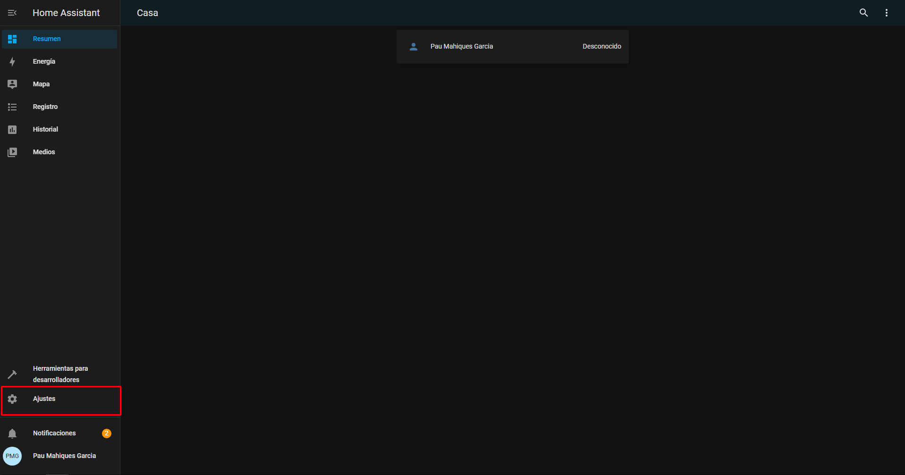

# Configurar Zigbee a traves de Home Assistant

## Requisitos

Para seguir esta guia tenemos que tener instalado Home Assistant, aqui tenemos dos guias para poder instalarlo:
* [Instalacion de Home Assistant a traves de consola](homeassistant_consola.md)
* [Instalacion de Home Assistant a traves de Docker](homeassistant_docker.md)

## Configuración

1. Ponemos el controlador Zigbee en la raspberry y reiniciamos Home Assistant
2. Iremos a la interfaz web de Home Assistant y iremos a "Ajustes"

3. Le damos a Dispositivos y servicios

4. Veremos que Home Assistant ha descubierto el controlador y le daremos a "CONFIGURAR"

5. Le daremos a "ENVIAR"

6. Indicaremos en que area tenemos el controlador y le daremos a "TERMINAR"

Y ya tendremos configurado Zigbee en Home Assistant
